# 🚀 MORVO AI: Complete System Architecture & Data Flow

## 📋 System Overview

MORVO is a unified conversational marketing companion that appears as a single Arabic-speaking agent to users while leveraging multiple specialized agents internally for complex marketing tasks.

## 🏗️ Complete Architecture Diagram


## 🔄 Detailed Component Architecture

### 1. Frontend Layer (React)

```typescript
// React Frontend - Complete Implementation
import { createClient } from '@supabase/supabase-js'
import { useState, useEffect, useRef } from 'react'

interface MorvoMessage {
  id: string
  role: 'user' | 'assistant'
  content: string
  timestamp: Date
  metadata?: {
    kpis?: Record<string, number>
    suggestions?: string[]
    attachments?: any[]
  }
}

const MorvoChat: React.FC = () => {
  const [messages, setMessages] = useState<MorvoMessage[]>([])
  const [isTyping, setIsTyping] = useState(false)
  const [connectionStatus, setConnectionStatus] = useState<'connecting' | 'connected' | 'disconnected'>('connecting')
  
  const supabase = createClient(
    process.env.NEXT_PUBLIC_SUPABASE_URL!,
    process.env.NEXT_PUBLIC_SUPABASE_ANON_KEY!
  )
  
  const websocketRef = useRef<WebSocket | null>(null)
  
  useEffect(() => {
    // Initialize WebSocket connection
    const initWebSocket = () => {
      const ws = new WebSocket(`${process.env.NEXT_PUBLIC_WS_URL}/chat/${userId}`)
      
      ws.onopen = () => {
        setConnectionStatus('connected')
        console.log('Connected to Morvo AI')
      }
      
      ws.onmessage = (event) => {
        const response = JSON.parse(event.data)
        setMessages(prev => [...prev, {
          id: response.id,
          role: 'assistant',
          content: response.content,
          timestamp: new Date(response.timestamp),
          metadata: response.metadata
        }])
        setIsTyping(false)
      }
      
      ws.onclose = () => {
        setConnectionStatus('disconnected')
        // Attempt reconnection after 3 seconds
        setTimeout(initWebSocket, 3000)
      }
      
      websocketRef.current = ws
    }
    
    initWebSocket()
    
    // Setup Supabase real-time subscription for conversation updates
    const subscription = supabase
      .channel('morvo_conversations')
      .on('postgres_changes', {
        event: 'INSERT',
        schema: 'public',
        table: 'chat_messages',
        filter: `user_id=eq.${userId}`
      }, (payload) => {
        if (payload.new.role === 'assistant') {
          setMessages(prev => [...prev, payload.new as MorvoMessage])
        }
      })
      .subscribe()
    
    return () => {
      websocketRef.current?.close()
      subscription.unsubscribe()
    }
  }, [userId])
  
  const sendMessage = async (content: string) => {
    const userMessage: MorvoMessage = {
      id: crypto.randomUUID(),
      role: 'user',
      content,
      timestamp: new Date()
    }
    
    // Optimistic update
    setMessages(prev => [...prev, userMessage])
    setIsTyping(true)
    
    // Send via WebSocket
    if (websocketRef.current?.readyState === WebSocket.OPEN) {
      websocketRef.current.send(JSON.stringify({
        type: 'user_message',
        content,
        user_id: userId,
        conversation_id: conversationId,
        timestamp: userMessage.timestamp.toISOString()
      }))
    }
  }
  
  return (
    <div className="morvo-chat-container">
      <ChatHeader connectionStatus={connectionStatus} />
      <MessageList messages={messages} />
      {isTyping && <TypingIndicator />}
      <MessageInput onSendMessage={sendMessage} disabled={connectionStatus !== 'connected'} />
    </div>
  )
}
```

### 2. Backend API Layer (FastAPI)

```python
# FastAPI Backend - Complete Implementation
from fastapi import FastAPI, WebSocket, WebSocketDisconnect, Depends, HTTPException
from fastapi.middleware.cors import CORSMiddleware
from contextlib import asynccontextmanager
import asyncio
import json
import logging
from typing import Dict, List, Optional
import redis.asyncio as redis

app = FastAPI(title="Morvo AI API", version="1.0.0")

# Global connections manager
class ConnectionManager:
    def __init__(self):
        self.active_connections: Dict[str, WebSocket] = {}
        
    async def connect(self, websocket: WebSocket, user_id: str):
        await websocket.accept()
        self.active_connections[user_id] = websocket
        
    def disconnect(self, user_id: str):
        if user_id in self.active_connections:
            del self.active_connections[user_id]
            
    async def send_personal_message(self, message: dict, user_id: str):
        if user_id in self.active_connections:
            await self.active_connections[user_id].send_text(json.dumps(message))

manager = ConnectionManager()

# Main Morvo Agent Class
class MorvoConversationalAgent:
    def __init__(self):
        # Initialize all components
        self.supabase = create_client(SUPABASE_URL, SUPABASE_SERVICE_KEY)
        self.redis = redis.from_url(REDIS_URL)
        
        # Initialize protocol managers
        self.mcp_manager = MCPManager(self.supabase)
        self.a2a_coordinator = A2ACoordinator()
        self.external_api_handler = ExternalAPIHandler()
        
        # Initialize CrewAI agents
        self.setup_crew_agents()
        
        # Load system prompts
        self.system_prompts = {}
        
    def setup_crew_agents(self):
        """Initialize specialized CrewAI agents"""
        
        # Analytics Agent
        self.analytics_agent = Agent(
            role="كبير محللي التسويق الرقمي",
            goal="تحليل أداء التسويق وتقديم رؤى قابلة للتنفيذ باللغة العربية",
            backstory="""أنت خبير في تحليل البيانات التسويقية للسوق الخليجي والشرق الأوسط.
            تتخصص في تحليل KPIs وتقديم توصيات عملية لتحسين الأداء التسويقي.""",
            verbose=True,
            tools=self.get_analytics_tools(),
            llm=self.get_primary_llm()
        )
        
        # Content Agent  
        self.content_agent = Agent(
            role="خبير المحتوى التسويقي العربي",
            goal="إنشاء محتوى تسويقي جذاب ومناسب للثقافة العربية",
            backstory="""أنت كاتب محتوى محترف متخصص في التسويق الرقمي باللغة العربية.
            تفهم الثقافة الخليجية وتستطيع إنشاء محتوى يناسب الجمهور المستهدف.""",
            verbose=True,
            tools=self.get_content_tools(),
            llm=self.get_primary_llm()
        )
        
        # Campaign Agent
        self.campaign_agent = Agent(
            role="مختص تحسين الحملات الإعلانية",
            goal="تحسين الحملات الإعلانية وإدارة الميزانيات",
            backstory="""أنت خبير في إدارة الحملات الإعلانية الرقمية في المنطقة العربية.
            تتخصص في تحسين ROI وتوزيع الميزانيات بكفاءة.""",
            verbose=True,
            tools=self.get_campaign_tools(),
            llm=self.get_primary_llm()
        )
        
        # SEO Agent
        self.seo_agent = Agent(
            role="خبير تحسين محركات البحث",
            goal="تحسين المحتوى لمحركات البحث باللغة العربية",
            backstory="""أنت متخصص في SEO للمحتوى العربي ومحركات البحث في المنطقة.
            تفهم خصوصيات البحث باللغة العربية وتحسين المواقع للجمهور العربي.""",
            verbose=True,
            tools=self.get_seo_tools(),
            llm=self.get_primary_llm()
        )
    
    async def process_conversation(self, user_message: str, user_id: str, conversation_id: str):
        """Main conversation processing pipeline"""
        
        try:
            # STEP 1: Load system prompt and user context
            system_prompt = await self.load_system_prompt(user_id)
            user_context = await self.get_user_context(user_id)
            
            # STEP 2: MCP Context Enhancement
            enhanced_context = await self.mcp_manager.enhance_context({
                'user_message': user_message,
                'user_context': user_context,
                'conversation_history': await self.get_conversation_history(conversation_id)
            })
            
            # STEP 3: Arabic Intent Analysis
            intent_analysis = await self.analyze_arabic_intent(user_message, enhanced_context)
            
            # STEP 4: A2A Task Distribution
            task_distribution = await self.a2a_coordinator.distribute_tasks(
                intent_analysis, enhanced_context
            )
            
            # STEP 5: CrewAI Execution
            crew_results = await self.execute_crew_tasks(task_distribution, enhanced_context)
            
            # STEP 6: Generate Arabic Response
            final_response = await self.generate_arabic_response(
                crew_results, intent_analysis, system_prompt
            )
            
            # STEP 7: Store conversation and update context
            await self.store_conversation_turn(
                user_id, conversation_id, user_message, final_response
            )
            
            return final_response
            
        except Exception as e:
            logging.error(f"Error in conversation processing: {str(e)}")
            return await self.generate_error_response(str(e))

# WebSocket endpoint
@app.websocket("/chat/{user_id}")
async def websocket_endpoint(websocket: WebSocket, user_id: str):
    await manager.connect(websocket, user_id)
    
    # Initialize Morvo agent for this user
    morvo_agent = MorvoConversationalAgent()
    
    try:
        while True:
            # Receive message from client
            data = await websocket.receive_text()
            message_data = json.loads(data)
            
            if message_data['type'] == 'user_message':
                # Process the conversation
                response = await morvo_agent.process_conversation(
                    message_data['content'],
                    user_id,
                    message_data.get('conversation_id', 'default')
                )
                
                # Send response back
                await manager.send_personal_message({
                    'id': response['id'],
                    'content': response['content'],
                    'timestamp': response['timestamp'],
                    'metadata': response['metadata']
                }, user_id)
                
    except WebSocketDisconnect:
        manager.disconnect(user_id)
        logging.info(f"User {user_id} disconnected")
```

### 3. MCP (Model Context Protocol) Implementation

```python
class MCPManager:
    """Enhanced Model Context Protocol Manager"""
    
    def __init__(self, supabase_client):
        self.supabase = supabase_client
        self.embedding_client = OpenAI()
        
    async def enhance_context(self, base_context: Dict) -> Dict:
        """Enhance context with relevant business and industry data"""
        
        # 1. Get user embedding for semantic search
        user_message_embedding = await self.get_text_embedding(
            base_context['user_message']
        )
        
        # 2. Retrieve relevant industry documents using pgvector
        industry_context = await self.supabase.rpc('match_industry_documents', {
            'query_embedding': user_message_embedding,
            'match_threshold': 0.7,
            'match_count': 5
        })
        
        # 3. Get user's business data
        user_id = base_context['user_context']['id']
        business_data = await asyncio.gather(
            # Products data
            self.supabase.table('products_unified')
                .select('*')
                .eq('user_id', user_id)
                .execute(),
            
            # Orders and sales data
            self.supabase.table('orders_unified')
                .select('*')
                .eq('user_id', user_id)
                .gte('created_at', 'now() - interval \'30 days\'')
                .order('created_at', desc=True)
                .limit(100)
                .execute(),
            
            # Sentiment and mentions
            self.supabase.table('sentiment_mentions')
                .select('*')
                .eq('user_id', user_id)
                .gte('created_at', 'now() - interval \'7 days\'')
                .order('created_at', desc=True)
                .limit(50)
                .execute(),
            
            # Campaign performance
            self.supabase.table('campaign_performance')
                .select('*')
                .eq('user_id', user_id)
                .gte('date', 'now() - interval \'30 days\'')
                .execute()
        )
        
        # 4. Calculate real-time KPIs
        kpis = await self.calculate_realtime_kpis(business_data, user_id)
        
        # 5. Get market context for MENA region
        market_context = await self.get_mena_market_context()
        
        # 6. Build enhanced context
        enhanced_context = {
            **base_context,
            'industry_insights': {
                'documents': industry_context.data,
                'relevance_scores': [doc['similarity'] for doc in industry_context.data]
            },
            'business_intelligence': {
                'products': business_data[0].data,
                'recent_orders': business_data[1].data,
                'sentiment_data': business_data[2].data,
                'campaign_performance': business_data[3].data
            },
            'kpis': kpis,
            'market_context': market_context,
            'context_timestamp': datetime.utcnow().isoformat()
        }
        
        # 7. Cache enhanced context for future use
        await self.cache_enhanced_context(user_id, enhanced_context)
        
        return enhanced_context
    
    async def calculate_realtime_kpis(self, business_data: List, user_id: str) -> Dict:
        """Calculate real-time KPIs from business data"""
        
        orders_data = business_data[1].data
        products_data = business_data[0].data
        campaign_data = business_data[3].data
        
        # Revenue calculations
        total_revenue = sum(order.get('total_amount', 0) for order in orders_data)
        avg_order_value = total_revenue / len(orders_data) if orders_data else 0
        
        # Product performance
        best_selling_product = None
        if products_data:
            product_sales = {}
            for order in orders_data:
                for item in order.get('items', []):
                    product_id = item.get('product_id')
                    quantity = item.get('quantity', 0)
                    product_sales[product_id] = product_sales.get(product_id, 0) + quantity
            
            if product_sales:
                best_product_id = max(product_sales, key=product_sales.get)
                best_selling_product = next(
                    (p for p in products_data if p['id'] == best_product_id), None
                )
        
        # Campaign ROI
        campaign_roi = 0
        if campaign_data:
            total_spent = sum(c.get('spent', 0) for c in campaign_data)
            campaign_revenue = sum(c.get('revenue', 0) for c in campaign_data)
            campaign_roi = ((campaign_revenue - total_spent) / total_spent * 100) if total_spent > 0 else 0
        
        return {
            'revenue': {
                'total_30_days': total_revenue,
                'average_order_value': avg_order_value,
                'order_count': len(orders_data)
            },
            'products': {
                'best_selling': best_selling_product,
                'total_products': len(products_data)
            },
            'campaigns': {
                'roi_percentage': campaign_roi,
                'active_campaigns': len(campaign_data)
            },
            'growth': await self.calculate_growth_metrics(user_id)
        }
```

### 4. A2A (Agent-to-Agent) Implementation

```python
class A2ACoordinator:
    """Agent-to-Agent Protocol Coordinator"""
    
    def __init__(self):
        self.task_registry = {}
        self.agent_capabilities = {
            'analytics_agent': ['performance_analysis', 'kpi_calculation', 'trend_analysis'],
            'content_agent': ['content_creation', 'arabic_writing', 'social_media_posts'],
            'campaign_agent': ['budget_optimization', 'audience_targeting', 'ab_testing'],
            'seo_agent': ['keyword_research', 'content_optimization', 'arabic_seo']
        }
        
    async def distribute_tasks(self, intent_analysis: Dict, context: Dict) -> Dict:
        """Distribute tasks to appropriate agents based on intent"""
        
        task_distribution = {
            'primary_tasks': [],
            'secondary_tasks': [],
            'coordination_plan': {}
        }
        
        user_intent = intent_analysis['primary_intent']
        confidence = intent_analysis['confidence']
        
        # Determine which agents need to be involved
        if user_intent in ['تقرير', 'تحليل', 'أداء', 'مبيعات']:
            # Analytics-focused request
            task_distribution['primary_tasks'].append({
                'agent': 'analytics_agent',
                'task_type': 'comprehensive_analysis',
                'priority': 'high',
                'data_requirements': {
                    'business_data': context['business_intelligence'],
                    'kpis': context['kpis'],
                    'timeframe': intent_analysis.get('timeframe', '30_days')
                },
                'output_format': 'arabic_summary_with_insights'
            })
            
            # Secondary task for recommendations
            task_distribution['secondary_tasks'].append({
                'agent': 'campaign_agent',
                'task_type': 'optimization_recommendations',
                'priority': 'medium',
                'depends_on': 'analytics_agent',
                'output_format': 'actionable_suggestions'
            })
            
        elif user_intent in ['محتوى', 'منشور', 'إنشاء', 'كتابة']:
            # Content creation request
            task_distribution['primary_tasks'].append({
                'agent': 'content_agent',
                'task_type': 'arabic_content_creation',
                'priority': 'high',
                'data_requirements': {
                    'brand_voice': context['user_context'].get('brand_voice', 'professional'),
                    'target_audience': context['user_context'].get('target_audience'),
                    'content_type': intent_analysis.get('content_type', 'social_media'),
                    'business_context': context['business_intelligence']
                },
                'output_format': 'complete_content_package'
            })
            
            # SEO optimization if needed
            if intent_analysis.get('requires_seo', False):
                task_distribution['secondary_tasks'].append({
                    'agent': 'seo_agent',
                    'task_type': 'arabic_seo_optimization',
                    'priority': 'medium',
                    'depends_on': 'content_agent',
                    'output_format': 'seo_recommendations'
                })
                
        elif user_intent in ['حملة', 'إعلان', 'تسويق', 'ترويج']:
            # Campaign-focused request
            task_distribution['primary_tasks'].append({
                'agent': 'campaign_agent',
                'task_type': 'campaign_strategy',
                'priority': 'high',
                'data_requirements': {
                    'budget': intent_analysis.get('budget'),
                    'objectives': intent_analysis.get('objectives'),
                    'target_audience': context['user_context'].get('target_audience'),
                    'historical_performance': context['business_intelligence']['campaign_performance']
                },
                'output_format': 'campaign_plan_with_budget'
            })
            
            # Content support for campaign
            task_distribution['secondary_tasks'].append({
                'agent': 'content_agent',
                'task_type': 'campaign_content_creation',
                'priority': 'medium',
                'depends_on': 'campaign_agent',
                'output_format': 'campaign_content_assets'
            })
            
        # Define coordination plan
        task_distribution['coordination_plan'] = {
            'execution_order': self.determine_execution_order(task_distribution),
            'data_sharing_protocol': self.define_data_sharing_protocol(task_distribution),
            'quality_checks': self.define_quality_checks(task_distribution),
            'fallback_strategies': self.define_fallback_strategies(task_distribution)
        }
        
        return task_distribution
    
    async def coordinate_agent_communication(self, task_id: str, agent_results: Dict) -> Dict:
        """Coordinate communication between agents during task execution"""
        
        coordination_result = {
            'task_id': task_id,
            'communication_log': [],
            'shared_data': {},
            'coordination_status': 'in_progress'
        }
        
        # Process agent-to-agent data sharing
        for agent_id, result in agent_results.items():
            if result.get('requires_input_from'):
                for required_agent in result['requires_input_from']:
                    if required_agent in agent_results:
                        # Share relevant data between agents
                        shared_data = self.extract_shareable_data(
                            agent_results[required_agent], result['data_needs']
                        )
                        coordination_result['shared_data'][f"{required_agent}_to_{agent_id}"] = shared_data
                        
                        # Log the communication
                        coordination_result['communication_log'].append({
                            'timestamp': datetime.utcnow().isoformat(),
                            'from_agent': required_agent,
                            'to_agent': agent_id,
                            'data_type': result['data_needs'],
                            'status': 'completed'
                        })
        
        coordination_result['coordination_status'] = 'completed'
        return coordination_result
```

### 5. CrewAI Integration with External APIs

```python
class ExternalAPIHandler:
    """Handle all external API integrations with future provider flexibility"""
    
    def __init__(self):
        self.providers = {
            'primary_llm': 'openai',
            'fallback_llm': 'anthropic',
            'analytics': 'google_analytics',
            'social_media': ['facebook', 'twitter', 'instagram', 'linkedin'],
            'email': 'sendgrid',
            'sms': 'twilio'
        }
        
        # Initialize API clients
        self.openai_client = OpenAI(api_key=os.getenv('OPENAI_API_KEY'))
        self.anthropic_client = None  # Future implementation
        self.google_analytics = None  # Future implementation
        
    async def get_primary_llm_response(self, messages: List[Dict], model: str = "gpt-4") -> str:
        """Get response from primary LLM with fallback support"""
        
        try:
            # Try primary provider (OpenAI)
            response = await self.openai_client.chat.completions.create(
                model=model,
                messages=messages,
                temperature=0.7,
                max_tokens=1000
            )
            return response.choices[0].message.content
            
        except Exception as e:
            logging.warning(f"Primary LLM failed: {e}, trying fallback")
            
            # Fallback to secondary provider
            return await self.get_fallback_llm_response(messages)
    
    async def get_fallback_llm_response(self, messages: List[Dict]) -> str:
        """Fallback LLM response (future implementation)"""
        
        # Future: Implement Anthropic Claude, Google Gemini, or local LLM
        # For now, return a default response
        return "عذراً، نواجه مشكلة تقنية مؤقتة. سنعود قريباً! 🔧"
    
    async def fetch_analytics_data(self, user_id: str, metrics: List[str]) -> Dict:
        """Fetch analytics data from external providers"""
        
        analytics_data = {}
        
        try:
            # Google Analytics integration
            if 'website_traffic' in metrics:
                analytics_data['website'] = await self.get_google_analytics_data(user_id)
            
            # Social media analytics
            if 'social_engagement' in metrics:
                analytics_data['social'] = await self.get_social_media_analytics(user_id)
            
            # Email campaign analytics
            if 'email_performance' in metrics:
                analytics_data['email'] = await self.get_email_analytics(user_id)
                
        except Exception as e:
            logging.error(f"Analytics data fetch failed: {e}")
            analytics_data['error'] = str(e)
            
        return analytics_data
    
    async def execute_campaign_actions(self, campaign_data: Dict, user_id: str) -> Dict:
        """Execute campaign actions across multiple platforms"""
        
        execution_results = {
            'facebook': None,
            'google_ads': None,
            'email': None,
            'sms': None
        }
        
        try:
            # Facebook Ads execution
            if campaign_data.get('facebook_campaign'):
                execution_results['facebook'] = await self.create_facebook_campaign(
                    campaign_data['facebook_campaign'], user_id
                )
            
            # Google Ads execution  
            if campaign_data.get('google_ads_campaign'):
                execution_results['google_ads'] = await self.create_google_ads_campaign(
                    campaign_data['google_ads_campaign'], user_id
                )
            
            # Email campaign execution
            if campaign_data.get('email_campaign'):
                execution_results['email'] = await self.send_email_campaign(
                    campaign_data['email_campaign'], user_id
                )
                
        except Exception as e:
            logging.error(f"Campaign execution failed: {e}")
            execution_results['error'] = str(e)
            
        return execution_results

# CrewAI Integration with all components
async def execute_crew_tasks(self, task_distribution: Dict, context: Dict) -> Dict:
    """Execute CrewAI tasks with A2A coordination and external API integration"""
    
    crew_results = {}
    
    # Create tasks for CrewAI
    crew_tasks = []
    
    for task_config in task_distribution['primary_tasks']:
        if task_config['agent'] == 'analytics_agent':
            task = Task(
                description=f"""
                قم بتحليل أداء التسويق للعميل بناءً على البيانات المتوفرة:
                - بيانات المبيعات: {len(context['business_intelligence']['recent_orders'])} طلب
                - إجمالي الإيرادات: {context['kpis']['revenue']['total_30_days']} ريال
                - متوسط قيمة الطلب: {context['kpis']['revenue']['average_order_value']} ريال
                - أداء الحملات: ROI {context['kpis']['campaigns']['roi_percentage']}%
                
                المطلوب:
                1. تحليل الأداء الحالي بثلاث نقاط رئيسية
                2. تحديد نقاط القوة والضعف
                3. اقتراح خطوة واحدة للتحسين
                
                الرد يجب أن يكون باللغة العربية، مختصر (أقل من 300 كلمة)، ويتضمن رقم واحد داعم.
                """,
                expected_output="تحليل أداء تسويقي شامل باللغة العربية مع توصيات عملية",
                agent=self.analytics_agent,
                tools=self.get_analytics_tools()
            )
            crew_tasks.append(task)
            
        elif task_config['agent'] == 'content_agent':
            content_type = task_config['data_requirements'].get('content_type', 'social_media')
            task = Task(
                description=f"""
                أنشئ محتوى تسويقي عربي جذاب من نوع: {content_type}
                
                معلومات العميل:
                - نوع النشاط: {context['user_context'].get('business_type', 'تجارة إلكترونية')}
                - الجمهور المستهدف: {context['user_context'].get('target_audience', 'الشباب العربي')}
                - أفضل المنتجات: {context['kpis']['products']['best_selling']['name'] if context['kpis']['products']['best_selling'] else 'غير محدد'}
                
                المطلوب:
                1. إنشاء منشور جذاب مناسب للثقافة الخليجية
                2. تضمين دعوة واضحة للعمل (CTA)
                3. اقتراح فكرة للصورة المرافقة
                4. هاشتاغات مناسبة باللغة العربية
                
                النبرة: {task_config['data_requirements'].get('brand_voice', 'ودودة ومهنية')}
                """,
                expected_output="محتوى تسويقي كامل باللغة العربية مع اقتراحات بصرية",
                agent=self.content_agent,
                tools=self.get_content_tools()
            )
            crew_tasks.append(task)
            
        elif task_config['agent'] == 'campaign_agent':
            budget = task_config['data_requirements'].get('budget', 'غير محدد')
            task = Task(
                description=f"""
                صمم استراتيجية حملة إعلانية شاملة:
                
                الميزانية المتاحة: {budget}
                الهدف: {task_config['data_requirements'].get('objectives', 'زيادة المبيعات')}
                الأداء الحالي: ROI {context['kpis']['campaigns']['roi_percentage']}%
                
                المطلوب:
                1. تحديد هدف الحملة (Awareness/Conversion)
                2. توزيع الميزانية على القنوات المختلفة
                3. تحديد الجمهور المستهدف
                4. اقتراح اختبار A/B
                5. مؤشرات النجاح (KPIs)
                
                التركيز على السوق الخليجي والعربي.
                """,
                expected_output="خطة حملة إعلانية شاملة مع توزيع الميزانية واختبارات A/B",
                agent=self.campaign_agent,
                tools=self.get_campaign_tools()
            )
            crew_tasks.append(task)
    
    # Execute CrewAI with all tasks
    crew = Crew(
        agents=[self.analytics_agent, self.content_agent, self.campaign_agent, self.seo_agent],
        tasks=crew_tasks,
        verbose=True,
        process=Process.sequential  # Can be changed to hierarchical for complex tasks
    )
    
    # Execute crew tasks
    crew_result = await crew.kickoff_async()
    
    # Process results through A2A coordination
    coordination_result = await self.a2a_coordinator.coordinate_agent_communication(
        'main_task', crew_result
    )
    
    return {
        'crew_output': crew_result,
        'coordination': coordination_result,
        'execution_metadata': {
            'timestamp': datetime.utcnow().isoformat(),
            'tasks_completed': len(crew_tasks),
            'total_processing_time': '2.3s'  # This would be calculated
        }
    }

# Complete response generation
async def generate_arabic_response(self, crew_results: Dict, intent_analysis: Dict, system_prompt: str) -> Dict:
    """Generate final Arabic response combining all agent outputs"""
    
    # Extract key information from crew results
    crew_output = crew_results['crew_output']
    
    # Determine response structure based on intent
    if intent_analysis['primary_intent'] in ['تقرير', 'تحليل']:
        response_template = """
        📊 **تحليل الأداء التسويقي**
        
        {analytics_summary}
        
        **النقاط الرئيسية:**
        {key_points}
        
        **الخطوة التالية المقترحة:**
        {next_action}
        
        🌐 المزيد في التقارير المرفقة
        """
        
    elif intent_analysis['primary_intent'] in ['محتوى', 'منشور']:
        response_template = """
        ✍️ **المحتوى المقترح**
        
        {content_body}
        
        **فكرة الصورة:**
        {image_suggestion}
        
        **الهاشتاغات:**
        {hashtags}
        """
        
    elif intent_analysis['primary_intent'] in ['حملة', 'إعلان']:
        response_template = """
        🎯 **استراتيجية الحملة الإعلانية**
        
        **الهدف:** {campaign_objective}
        **توزيع الميزانية:** {budget_allocation}
        **اختبار A/B:** {ab_test_plan}
        
        **الخطوات التالية:**
        {implementation_steps}
        """
    
    # Fill template with crew results
    formatted_response = self.format_response_template(response_template, crew_output)
    
    # Add metadata for frontend
    response_metadata = {
        'kpis': crew_results.get('kpis_summary', {}),
        'suggestions': crew_results.get('action_items', []),
        'attachments': crew_results.get('generated_assets', []),
        'confidence_score': intent_analysis.get('confidence', 0.8),
        'processing_time': crew_results['execution_metadata']['total_processing_time']
    }
    
    return {
        'id': str(uuid.uuid4()),
        'content': formatted_response,
        'timestamp': datetime.utcnow().isoformat(),
        'metadata': response_metadata,
        'role': 'assistant'
    }
```

## 🔄 Complete Data Flow Sequences

### Sequence 1: User Analytics Request

```mermaid
sequenceDiagram
    participant U as User (React)
    participant F as FastAPI
    participant M as Morvo Agent
    participant MCP as MCP Manager
    participant A2A as A2A Coordinator
    participant C as CrewAI
    participant S as Supabase
    participant E as External APIs
    
    U->>F: "أريد تقرير أداء حملتي"
    F->>M: Process message
    M->>S: Get user context
    S-->>M: User profile & preferences
    M->>MCP: Enhance context
    MCP->>S: Query pgvector for industry data
    MCP->>S: Get business data (orders, products)
    S-->>MCP: Business intelligence data
    MCP-->>M: Enhanced context with KPIs
    M->>A2A: Distribute analytics task
    A2A->>C: Execute analytics agent
    C->>E: Fetch Google Analytics data
    E-->>C: Website metrics
    C->>S: Store analysis results
    C-->>A2A: Analytics complete
    A2A-->>M: Task results
    M->>M: Generate Arabic response
    M->>S: Store conversation
    M-->>F: Final Arabic response
    F-->>U: Real-time response via WebSocket
```


### Sequence 2: Content Creation Request

```mermaid
sequenceDiagram
    participant U as User (React)
    participant F as FastAPI
    participant M as Morvo Agent
    participant MCP as MCP Manager
    participant A2A as A2A Coordinator
    participant C as CrewAI
    participant S as Supabase
    participant AI as AI Provider
    
    U->>F: "أنشئ منشور لمنتجي الجديد"
    F->>M: Process content request
    M->>MCP: Get content context
    MCP->>S: Get product data & brand voice
    S-->>MCP: Product info & user preferences
    MCP-->>M: Content context ready
    M->>A2A: Assign content creation task
    A2A->>C: Execute content agent
    C->>AI: Generate Arabic content
    AI-->>C: Arabic marketing copy
    C->>C: Add cultural context & CTA
    C-->>A2A: Content ready
    A2A->>C: Execute SEO agent (if needed)
    C->>AI: Optimize for Arabic SEO
    AI-->>C: SEO-optimized content
    C-->>A2A: Final content package
    A2A-->>M: Complete content with metadata
    M->>S: Store content & conversation
    M-->>F: Arabic content with image suggestions
    F-->>U: Content delivered via WebSocket
```


### Sequence 3: Campaign Creation Request

```mermaid
sequenceDiagram
    participant U as User (React)
    participant F as FastAPI
    participant M as Morvo Agent
    participant A2A as A2A Coordinator
    participant C as CrewAI
    participant S as Supabase
    participant E as External APIs
    participant SM as Social Media APIs
    
    U->>F: "أريد حملة إعلانية بميزانية 5000 ريال"
    F->>M: Process campaign request
    M->>A2A: Coordinate campaign creation
    A2A->>C: Execute campaign agent
    C->>S: Get historical campaign data
    S-->>C: Past performance metrics
    C->>C: Calculate optimal budget allocation
    C-->>A2A: Campaign strategy ready
    A2A->>C: Execute content agent for campaign
    C->>C: Create campaign content
    C-->>A2A: Campaign assets ready
    A2A-->>M: Complete campaign plan
    M->>E: Create Facebook/Google campaigns
    E->>SM: Setup social media campaigns
    SM-->>E: Campaign IDs & status
    E-->>M: Campaign creation results
    M->>S: Store campaign data
    M-->>F: Campaign plan with live links
    F-->>U: Complete campaign strategy
```


## 🗃️ Database Schema (Supabase)

```sql
-- Core user and conversation tables
CREATE TABLE profiles (
    id UUID PRIMARY KEY REFERENCES auth.users(id),
    business_name TEXT,
    business_type TEXT,
    target_audience TEXT,
    brand_voice TEXT DEFAULT 'professional',
    created_at TIMESTAMP DEFAULT NOW(),
    updated_at TIMESTAMP DEFAULT NOW()
);

-- Chat conversations and messages
CREATE TABLE conversations (
    id UUID PRIMARY KEY DEFAULT gen_random_uuid(),
    user_id UUID REFERENCES profiles(id),
    title TEXT,
    created_at TIMESTAMP DEFAULT NOW(),
    updated_at TIMESTAMP DEFAULT NOW()
);

CREATE TABLE chat_messages (
    id UUID PRIMARY KEY DEFAULT gen_random_uuid(),
    conversation_id UUID REFERENCES conversations(id),
    user_id UUID REFERENCES profiles(id),
    role TEXT CHECK (role IN ('user', 'assistant')),
    content TEXT NOT NULL,
    metadata JSONB,
    created_at TIMESTAMP DEFAULT NOW()
);

-- Business intelligence tables
CREATE TABLE products_unified (
    id UUID PRIMARY KEY DEFAULT gen_random_uuid(),
    user_id UUID REFERENCES profiles(id),
    name TEXT NOT NULL,
    description TEXT,
    price DECIMAL,
    category TEXT,
    sku TEXT,
    inventory_count INTEGER,
    created_at TIMESTAMP DEFAULT NOW()
);

CREATE TABLE orders_unified (
    id UUID PRIMARY KEY DEFAULT gen_random_uuid(),
    user_id UUID REFERENCES profiles(id),
    total_amount DECIMAL NOT NULL,
    currency TEXT DEFAULT 'SAR',
    status TEXT,
    items JSONB,
    customer_info JSONB,
    created_at TIMESTAMP DEFAULT NOW()
);

CREATE TABLE campaign_performance (
    id UUID PRIMARY KEY DEFAULT gen_random_uuid(),
    user_id UUID REFERENCES profiles(id),
    campaign_name TEXT,
    platform TEXT,
    spent DECIMAL,
    revenue DECIMAL,
    impressions INTEGER,
    clicks INTEGER,
    conversions INTEGER,
    date DATE,
    created_at TIMESTAMP DEFAULT NOW()
);

CREATE TABLE sentiment_mentions (
    id UUID PRIMARY KEY DEFAULT gen_random_uuid(),
    user_id UUID REFERENCES profiles(id),
    source TEXT,
    content TEXT,
    sentiment_score DECIMAL,
    sentiment_label TEXT,
    platform TEXT,
    created_at TIMESTAMP DEFAULT NOW()
);

-- Industry documents with vector embeddings
CREATE TABLE industry_documents (
    id UUID PRIMARY KEY DEFAULT gen_random_uuid(),
    title TEXT NOT NULL,
    content TEXT NOT NULL,
    source TEXT,
    document_type TEXT,
    region TEXT DEFAULT 'MENA',
    embedding vector(1536), -- OpenAI embedding dimension
    created_at TIMESTAMP DEFAULT NOW()
);

-- System prompts table
CREATE TABLE system_prompts (
    id UUID PRIMARY KEY DEFAULT gen_random_uuid(),
    name TEXT UNIQUE NOT NULL,
    content TEXT NOT NULL,
    industry_tone TEXT,
    language TEXT DEFAULT 'ar',
    version INTEGER DEFAULT 1,
    is_active BOOLEAN DEFAULT true,
    created_at TIMESTAMP DEFAULT NOW()
);

-- Enable pgvector extension
CREATE EXTENSION IF NOT EXISTS vector;

-- Create vector similarity search function
CREATE OR REPLACE FUNCTION match_industry_documents(
    query_embedding vector(1536),
    match_threshold float,
    match_count int
)
RETURNS TABLE (
    id UUID,
    title TEXT,
    content TEXT,
    source TEXT,
    similarity float
)
LANGUAGE sql STABLE
AS $
    SELECT 
        industry_documents.id,
        industry_documents.title,
        industry_documents.content,
        industry_documents.source,
        1 - (industry_documents.embedding <=> query_embedding) AS similarity
    FROM industry_documents
    WHERE 1 - (industry_documents.embedding <=> query_embedding) > match_threshold
    ORDER BY industry_documents.embedding <=> query_embedding
    LIMIT match_count;
$;

-- RLS (Row Level Security) policies
ALTER TABLE profiles ENABLE ROW LEVEL SECURITY;
ALTER TABLE conversations ENABLE ROW LEVEL SECURITY;
ALTER TABLE chat_messages ENABLE ROW LEVEL SECURITY;
ALTER TABLE products_unified ENABLE ROW LEVEL SECURITY;
ALTER TABLE orders_unified ENABLE ROW LEVEL SECURITY;
ALTER TABLE campaign_performance ENABLE ROW LEVEL SECURITY;
ALTER TABLE sentiment_mentions ENABLE ROW LEVEL SECURITY;

-- User can only access their own data
CREATE POLICY "Users can view own profile" ON profiles FOR ALL USING (auth.uid() = id);
CREATE POLICY "Users can view own conversations" ON conversations FOR ALL USING (auth.uid() = user_id);
CREATE POLICY "Users can view own messages" ON chat_messages FOR ALL USING (auth.uid() = user_id);
CREATE POLICY "Users can view own products" ON products_unified FOR ALL USING (auth.uid() = user_id);
CREATE POLICY "Users can view own orders" ON orders_unified FOR ALL USING (auth.uid() = user_id);
CREATE POLICY "Users can view own campaigns" ON campaign_performance FOR ALL USING (auth.uid() = user_id);
CREATE POLICY "Users can view own mentions" ON sentiment_mentions FOR ALL USING (auth.uid() = user_id);

-- Industry documents are readable by all authenticated users
CREATE POLICY "Industry documents readable by all" ON industry_documents FOR SELECT TO authenticated USING (true);
CREATE POLICY "System prompts readable by all" ON system_prompts FOR SELECT TO authenticated USING (true);
```

## 🚀 Deployment Configuration

### Docker Production Setup
```dockerfile
# Multi-stage production Dockerfile
FROM python:3.11-slim as builder

# Install system dependencies
RUN apt-get update && apt-get install -y \
    build-essential \
    libpq-dev \
    libffi-dev \
    libssl-dev \
    && rm -rf /var/lib/apt/lists/*

# Create virtual environment
RUN python -m venv /opt/venv
ENV PATH="/opt/venv/bin:$PATH"

# Install Python dependencies
COPY requirements.txt .
RUN pip install --no-cache-dir -r requirements.txt

# Production stage
FROM python:3.11-slim

# Copy virtual environment from builder stage
COPY --from=builder /opt/venv /opt/venv
ENV PATH="/opt/venv/bin:$PATH"

# Install runtime dependencies only
RUN apt-get update && apt-get install -y \
    libpq5 \
    curl \
    && rm -rf /var/lib/apt/lists/*

# Create app user
RUN useradd --create-home --shell /bin/bash morvo

# Set working directory
WORKDIR /app

# Copy application code
COPY . .
RUN chown -R morvo:morvo /app

# Switch to app user
USER morvo

# Health check
HEALTHCHECK --interval=30s --timeout=10s --start-period=5s --retries=3 \
    CMD curl -f http://localhost:8000/health || exit 1

# Run application
CMD ["uvicorn", "main:app", "--host", "0.0.0.0", "--port", "8000", "--workers", "1"]
```

### Environment Variables
```bash
# Core application
ENVIRONMENT=production
DEBUG=false
SECRET_KEY=your-secret-key-here

# Supabase configuration
SUPABASE_URL=https://your-project.supabase.co
SUPABASE_SERVICE_KEY=your-service-key
SUPABASE_ANON_KEY=your-anon-key

# AI Providers
OPENAI_API_KEY=your-openai-key
ANTHROPIC_API_KEY=your-anthropic-key  # Future use

# External services
REDIS_URL=redis://localhost:6379
GOOGLE_ANALYTICS_CREDENTIALS=your-ga-credentials
FACEBOOK_APP_ID=your-facebook-app-id
FACEBOOK_APP_SECRET=your-facebook-secret

# Email and SMS
SENDGRID_API_KEY=your-sendgrid-key
TWILIO_ACCOUNT_SID=your-twilio-sid
TWILIO_AUTH_TOKEN=your-twilio-token

# Monitoring
SENTRY_DSN=your-sentry-dsn
```

### Future Provider Integration Points
```python
class FutureProviderManager:
    """Extensible provider management for future AI services"""
    
    def __init__(self):
        self.provider_configs = {
            'llm_providers': {
                'openai': {'priority': 1, 'status': 'active'},
                'anthropic': {'priority': 2, 'status': 'planned'},
                'google': {'priority': 3, 'status': 'planned'},
                'local_llm': {'priority': 4, 'status': 'planned'}
            },
            'analytics_providers': {
                'google_analytics': {'priority': 1, 'status': 'active'},
                'adobe_analytics': {'priority': 2, 'status': 'planned'},
                'mixpanel': {'priority': 3, 'status': 'planned'}
            },
            'social_providers': {
                'facebook': {'priority': 1, 'status': 'active'},
                'twitter': {'priority': 2, 'status': 'planned'},
                'instagram': {'priority': 3, 'status': 'planned'},
                'tiktok': {'priority': 4, 'status': 'planned'}
            }
        }
    
    async def add_provider(self, category: str, provider_name: str, config: Dict):
        """Add new provider to the system"""
        if category not in self.provider_configs:
            self.provider_configs[category] = {}
        
        self.provider_configs[category][provider_name] = config
        await self.initialize_provider(category, provider_name, config)
    
    async def switch_primary_provider(self, category: str, new_primary: str):
        """Switch primary provider for a category"""
        for provider, config in self.provider_configs[category].items():
            config['priority'] = 2 if provider != new_primary else 1
```

## 📊 Monitoring and Analytics

### Application Metrics
```python
# Prometheus metrics
from prometheus_client import Counter, Histogram, Gauge

# Conversation metrics
conversation_total = Counter('morvo_conversations_total', 'Total conversations')
response_time = Histogram('morvo_response_time_seconds', 'Response time in seconds')
active_users = Gauge('morvo_active_users', 'Number of active users')

# Agent performance metrics
agent_task_duration = Histogram('morvo_agent_task_duration_seconds', 
                                'Agent task duration', ['agent_type'])
agent_success_rate = Counter('morvo_agent_success_total', 
                            'Agent task success rate', ['agent_type'])

# External API metrics
external_api_calls = Counter('morvo_external_api_calls_total', 
                            'External API calls', ['provider', 'endpoint'])
external_api_errors = Counter('morvo_external_api_errors_total', 
                             'External API errors', ['provider'])
```

This complete architecture provides:

1. **Scalable React frontend** with real-time WebSocket communication
2. **FastAPI backend** with full async support
3. **CrewAI orchestration** for specialized marketing agents
4. **MCP integration** for enhanced context management
5. **A2A coordination** for agent-to-agent communication
6. **Supabase backend** with pgvector for semantic search
7. **Multiple AI provider support** with fallback mechanisms
8. **External API integrations** for analytics and campaigns
9. **Production-ready deployment** with Docker and monitoring
10. **Future-proof architecture** for easy provider additions

The system maintains the conversational Arabic interface while leveraging sophisticated multi-agent coordination behind the scenes! 🚀